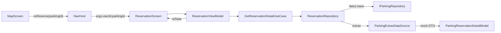

# Reserva de Parqueos – Flujo y Arquitectura

## 1. Disparo desde el mapa
- **Archivo:** `feature/map/presentation/MapScreen.kt`
- El `BottomSheet` muestra un botón *Reservar*. Al presionarlo se ejecuta `onNavigateToReservation(routeInfo.destination.id)`.
- El mapper conserva el `parkingId` para saber cuál parqueo se reservará.

## 2. Navegación
- **Archivo:** `navigation/AppNavigation.kt`
- Se añadió la ruta `reservation/{userId}/{parkingId}`. El `NavController` recibe ambos argumentos (el `userId` ya se usa en otras pantallas; el `parkingId` se utiliza en la reserva).
- La pantalla `ReservationScreen` vive en la gráfica principal, por lo que no hay back stack adicional; el botón *Atrás* hace `popBackStack`.

## 3. Inyección de dependencias
- **Archivo:** `di/ReservationModule.kt`
    - Define:
        - `ParkingExtrasDataSource`: datos mock que simulan respuesta de BD/API.
        - `ReservationRepositoryImpl`: combina parqueo base + extras.
        - `GetReservationDetailUseCase`: capa de dominio.
        - `ReservationViewModel`: acepta `parkingId` como parámetro (via `parametersOf`).
- El `App.kt` registra este módulo junto con los ya existentes (`auth`, `map`, `profile`).

## 4. Capas de datos/dominio
- **IParkingRepository.getParkingById** (`feature/map/domain/repository/IParkingRepository.kt`): método nuevo que reutiliza el cache de parqueos.
- **ReservationRepositoryImpl** (`feature/reservation/data/repository/...`):
    - Obtiene el `ParkingLocationModel` por ID.
    - Consulta el `ParkingExtrasDataSource` para completar `imageUrl`, amenities y descripción (hardcodeados con un `TODO` para sustituirlos por BD real).
    - Exporta un `ParkingReservationDetailModel`.
- **GetReservationDetailUseCase**: simple wrapper de dominio.

## 5. ViewModel
- **Archivo:** `feature/reservation/presentation/ReservationViewModel.kt`
- Responsabilidades:
    - `loadReservationDetail()` al inicializar (carga datos + estados por defecto).
    - Manejar selección de fecha (`LocalDate`) y horas (`LocalTime`).
    - Calcular costo estimado (`ceil(minutes/60) * pricePerHour`).
    - `onReserve()` quedó como `// TODO` para conectar con backend.
- El estado expuesto (`ReservationUiState`) contiene:
    - `detail`: `ParkingReservationDetailModel`.
    - `selectedDate`, `entryTime`, `exitTime`, `totalCost`.
    - `validationError`, `errorMessage`, `isLoading`.

## 6. UI (Jetpack Compose)
- **Archivo:** `feature/reservation/presentation/ReservationScreen.kt`
- Estructura:
    - `Scaffold` con `CenterAlignedTopAppBar` y `ReservationBottomBar`.
    - Secciones: imagen grande (`AsyncImage`), info del parqueo, amenities (`AmenitiesGrid`), selectores de fecha/hora y costo.
    - Dialogs nativos:
        - `showDatePickerDialog` (limita a fechas >= hoy).
        - `showTimePickerDialog` (24h).
    - Botón “Reservar”: habilitado solo sin errores de validación.
- Desugaring habilitado para usar `java.time` con `minSdk 24`.

## 7. TODOs / próximos pasos
1. Implementar `ReservationViewModel.onReserve()` conectando con el backend (enviar `userId`, `parkingId`, fecha/horas).
2. Reemplazar `ParkingExtrasDataSource` por una fuente real (REST/Firestore/Room).
3. Añadir feedback visual al confirmar la reserva (snackbar, navegación a pantalla de éxito).
4. Validaciones adicionales (horarios fuera de `operatingHours`, choque con reservas existentes, etc.).

---

Esta documentación resume dónde vive cada pieza del flujo y cómo se conectan. Referencia rápida:

| Capa | Archivo | Descripción |
| --- | --- | --- |
| Navegación | `navigation/AppNavigation.kt` | Ruta `reservation/{userId}/{parkingId}` |
| DI | `di/ReservationModule.kt` | Define datasource, repo, usecase, VM |
| Datos | `feature/reservation/data/...` | Repositorio + datasource mock |
| Dominio | `feature/reservation/domain/...` | Modelo + usecase |
| Presentación | `feature/reservation/presentation/...` | ViewModel + Compose screen |
| Map Feature | `feature/map/presentation/MapScreen.kt` | Lanza navegación de reservas |
